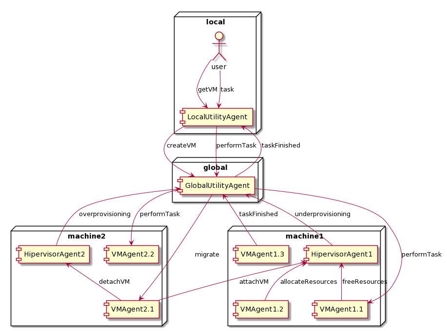
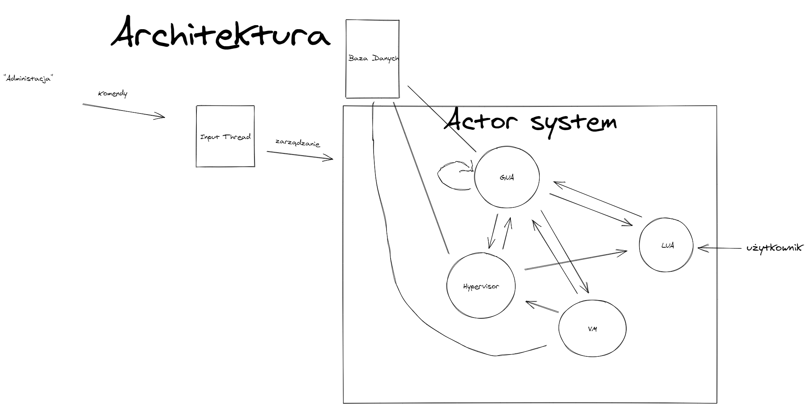
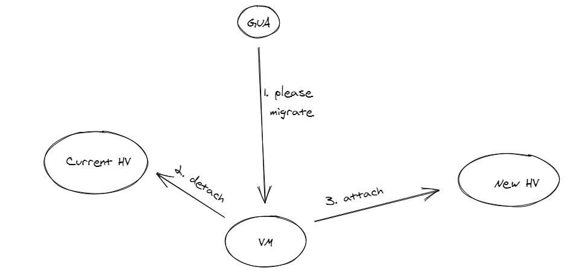
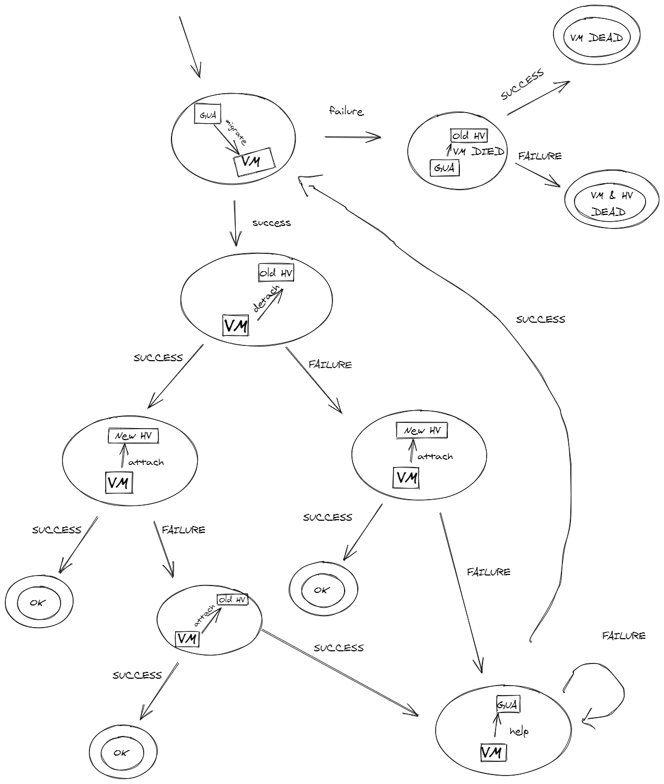
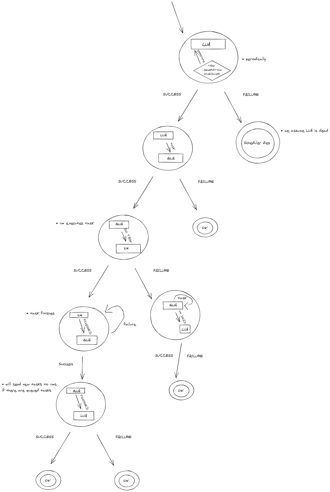
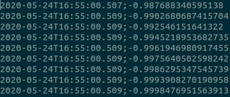
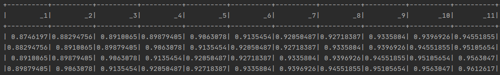
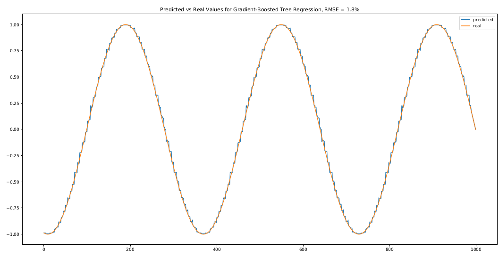
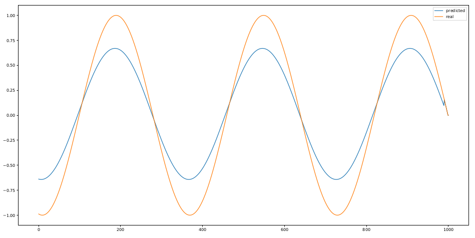

## Sprawozdanie z Projektu SAG WEITI PW 2020
Autorzy: Paulina Szwed, Robert Piwowarek, Dawid Sitnik  
## 1. Koncepcja
### Cel zadania, architektura
Celem zadania jest zbudowanie agentowego systemu do optymalizacji zużycia zasobów w chmurze. Optymalizacja powinna zapewnić minimalne zużycie
energii przez fizyczne maszyny przy jednoczesnym spełnieniu wymagań czasowych dotyczących realizacji zadań użytkowników (SLA). Proponujemy
wykorzystać do tego architekturę, w której główne role odgrywają dwa typy agentów - agent lokalny, modyfikujący żądania użytkowników dotyczące zasobów
oraz globalny, zarządzający dystrybucją zasobów i migracjami maszyn wirtualnych.

### Agent lokalny
Głównym zadaniem agenta lokalnego jest obserwowanie zużycia zasobów maszyn przez przypisanego do niego klienta oraz budowanie historii, 
która umożliwiłaby przewidywanie wymagań użytkownika w chwili t+N. Zbierane dane są przekształcane do postaci szeregu czasowego składającego się 
z wymagań na zasoby systemowe w chwilach t-1, t-2, ..., t-N.

Dane te są na bieżąco aktualizowane, w celu poprawienia jakości modelu predykcyjnego służącego do przewidywania wymagań użytkownika. 
Celem tego typu podejścia jest uniknięcie sytuacji, w których klientowi zostałoby przypisanych zbyt wiele lub zbyt mało zasobów, 
biorąc pod uwagę także inne kwestie, takie jak liczba zapytań na jednostkę czasową, czas odpowiedzi itp. Wynik przewidywania jest 
kolejnie wysyłany to agenta globalnego, którego zadaniem jest zarządzanie zasobami i w razie potrzeby odebranie lub przydzielenie ich większej ilości. [1]

Architektura oraz schemat przepływu informacji agenta lokalnego są przedstawione na poniższych ilustracjach.

  
   <figcaption>Architektura agenta lokalnego [1]</figcaption>

  
   <figcaption>Schemat przepływu informacji w obrębie agenta lokalnego [1]</figcaption>

W celu przewidywania wymagań klienta agent korzysta z jednego z modeli statystycznych służących do przewidywania wartości ciągłych. 
Aby był on w stanie działać w czasie rzeczywistym, musi być na tyle prosty w budowie, aby czas jego aktualizacji nie zakłócał pracy użytkownika. 
Modelami spełniającymi dane wymagania byłyby prawdopodobnie regresja liniowa, perceptron bądź las losowy. Dla przykładu, 
skupimy się na opisie tylko jednego z nich. Mimo wszystko podczas implementacji przetestujemy każdy, wybierając ten, 
który spełnia wyżej opisane wymagania dając jednocześnie najlepszą jakość przewidywań.

#### Model regresji liniowej
Zbiór danych historycznych będzie reprezentowany w postaci {yi, xi1, ..., xip}^n, gdzie zmienne xi1, ...xip będą kolejnymi wartościami szeregu czasowego stworzonego na podstawie historii zużycia danych przez użytkownika. Model regresji liniowej zakłada, że istnieje liniowa relacja pomiędzy zmienną zależną y a wektorem p x 1 regresorów xi.  Zależność ta jest modelowana przez uwzględnienie składnika losowego (błędu) Epsilon, który jest zmienną losową. Dokładniej, model ten jest postaci:

  

dla i = 1, ..., n

W danym przypadku symbol T służy do reprezentowania transpozycji, więc xi ^ T * B to iloczyn skalarny xi oraz B.

Dla uproszczenia obliczeń, powyższe równanie można zapisać w sposób macierzowy y = XB + epsilon, gdzie:

  

Najczęściej wykorzystuje się do tego celu klasyczną metodę najmniejszych kwadratów i jej pochodne. Metoda ta jest najstarsza i najłatwiejsza do zastosowania, choć posiada wady (np. niewielką odporność na elementy odstające), które udało się usunąć we wspomnianych pozostałych metodach.

### Agent globalny
Agent globalny odpowiedzialny jest za przydzielanie zasobów chmury w taki sposób, aby
zoptymalizować zużycie energii, a tym samym koszty utrzymania chmury. Optymalizacja odbywa się poprzez
utrzymanie właściwego rozkładu maszyn wirtualnych na maszynach fizycznych oraz propagowanie zadań 
od użytkowników na ich maszyny wirtualne.

Agent globalny redukuje liczbę uruchomionych (a zatem pobierających energię) maszyn fizycznych poprzez migracje i
redukcję liczby aktywnych maszyn wirtualnych, równocześnie starając się aby wykonanych migracji było możliwie najmniej. 
Dokonuje tego poprzez szybkie zwalnianie zasobów
wykorzystywanych przez konkretną maszynę wirtualną, gdy skończy ona wykonywać zadania. Zwolnione zasoby
mogą zostać przydzielone innej maszynie wirtualnej, bez potrzeby alokowania ich na kolejnej maszynie 
fizycznej. Agent globalny pozostaje w ciągłej komunikacji z hipernadzorcami maszyn fizycznych, dzięki 
czemu jest w stanie dostarczać użytkownikom żądane zasoby i zwalniać je, gdy tylko jest to możliwe.

W sytuacji, gdy maszyny wirtualne na maszynie danego hipernadzorcy zużywają za dużo zasobów, powiadamia on o tym globalnego agenta. 
Globalny agent następnie wybiera maszynę wirtualną, która najbardziej wpływa na przeciążenie maszyny fizycznej (np. tę, która 
zużywa najwięcej przeciążonego zasobu) i dokonuje jej migracji na inną maszynę fizyczną.

Jeżeli natomiast zajdzie sytuacja, w której maszyna fizyczna jest obciążona w małym stopniu, a w systemie 
znajdują się inne maszyny, na których mogłyby działać uruchomione na niej maszyny wirtualne, hipernadzorca
również powiadamia globalnego agenta. Globalny agent migruje wtedy wszystkie maszyny wirtualne ze wskazanej
maszyny fizycznej do innych maszyn, redukując w ten sposób liczbę pracujących maszyn o 1. [1]

Redukcja uruchomionych maszyn fizycznych następuje również poprzez przyjęcie konkretnej strategii alokacji
zasobów dla nowych maszyn wirtualnych. Proponujemy przyjęcie strategii podobnej do [2], w której wybieramy zasób, na który nowa 
maszyna ma największe zapotrzebowanie, następnie spośród pracujących maszyn fizycznych wybieramy tę, która posiada go najmniej, ale jest w stanie zapewnić
wystarczająco dużo zasobów nowej maszynie wirtualnej. Jeżeli żadna z już pracujących maszyn fizycznych nie
jest w stanie uruchomić nowej maszyny wirtualnej, dokonujemy aktywacji kolejnej maszyny fizycznej, przy czym
wybierana jest ta o najmniejszym zużyciu energii. 

Aby efektywnie zwalniać zasoby maszyn fizycznych, agent globalny zapewnia również strategię przyporządkowywania 
zadań do maszyn wirtualnych w taki sposób, aby jak najwięcej z nich mogło wykonywać się równolegle. Proponujemy 
metodę opartą o zasoby, analogiczną do alokacji zasobów dla maszyn wirtualnych, która została opisana powyżej.
Wybieramy zasób najistotniejszy dla zadania, następnie maszynę wirtualną, która posiada go najmniej, ale jest 
w stanie zapewnić wykonanie zadania. W przypadku gdy żadna z maszyn użytkownika nie posiada wystarczającej ilości
zasobów, zadanie jest kolejkowane. Istnieją też inne metody szeregowania zadań, w szczególności takie oparte o czas
wykonania, które dają dobre rezultaty, jednak w środowisku w którym do puli ciągle napływają nowe zadania, istnieje
ryzyko, ze zadania o skrajnie długim lub skrajnie krótkim czasie wykonania nigdy nie zostaną przydzielone maszynie
wirtualnej. Przyjmujemy założenie że czas oczekiwania użytkownika na wykonanie zadania powinien być jak najkrótszy,
dlatego zdecydowaliśmy się wybrać strategię opartą o zasoby. 

### Symulacja środowiska chmurowego

W celu realizacji projektu proponujemy wykonanie pomocnicznych agentów w celu symulacji środowiska chmurowego.
Dostarczamy agenta symulującego zachowanie hipernadzorcy oraz maszyny wirtualnej. Komunikacja pomiędzy agentami
przedstawiona jest na rysuku poniżej:

   
   <figcaption>Komunikacja pomiędzy agentami</figcaption>

Wymieniane są następujące komunikaty:
 - createVM - żądanie utworzenia maszyny wirtualnej,
 - performTask - żądanie wykonania zadania na jednej z maszyn użytkownika,
 - taskFinished - powiadomienie o ukończeniu zadania,
 - allocateResources - żądanie przydzielenia zasobów uruchomionej lub nowoutworzonej maszynie wirtualnej,
 - freeResources - żądanie zwolnienia zasobów maszyny, która nie wykonuje już zadań,
 - underprovisioning - komunikat o niewystarczająco dużym stopniu alokacji zasobów maszyny fizycznej,
 - overprovisioning - komunikat o nadmiernej alokacji zasobów maszyny fizycznej,
 - attachVM - żądanie przydzielenia zasobów maszynie wirtualnej, wykorzystywane przy tworzeniu nowej maszyny oraz przy migracji,
 - detachVM - komunikat o możliwości usunięcia maszyny z listy danego hipernadzorcy (z maszyny fizycznej), wykorzystywany przy migracji.

## 2. Implementacja

### Architektura

  
   <figcaption>Architektura systemu</figcaption>

### Główne Procesy

#### Migracja - sukces

  
   <figcaption>Proces pomyślnej migracji</figcaption>

#### Migracja - szerszy kontekst

  
   <figcaption>Proces migracji</figcaption>

#### Tworzenie zadania

  
   <figcaption>Proces tworzenia zadania</figcaption>

### Agent lokalny
Celem agenta lokalnego jest obserwowanie zużycia zasobów przez klienta, przewidywanie ich zużycia w chwili *t+1* i informowanie o tym **agenta globalnego**. Aby zasymulować sytuację na której możliwe będzie przetestowanie systemu, agent lokalny generuje nowe zadania (ze zużyciami zasobów bazującymi na przewidywaniach modelu). Działanie agenta jest niezależne od funkcji symulującej zużycie zasobów systemowych, więc jest on w stanie przewidzieć wartość dowolnej funkcji.

#### Kroki podejmowane przez agenta lokalnego w celu przewidzenia zużycia zasobów:
1. Wczytanie historii zużycia zasobów z poprzednio wykonywanej pracy z pliku.
2. Przekształcenie historii do postaci odpowiedniej dla modelu.
3. Trenowanie modelu.
4. Generowanie kolejnych wartości funkcji *sin* zależności od czasu i predykcja wartości w chwili t+1
5. Zapisanie historii. 

#### Dokładny opis działania agenta lokalnego
**1. Wczytanie historii zużycia zasobów z poprzednio wykonywanej pracy z pliku**

Historia zużycia zasobów jest przechowywana w pliku txt, w którego jednej linii przechowywana jest informacja na temat ilości zużytych danych w postaci liczby zmiennoprzecinkowej oraz chwili, w której wystąpiło dane zdarzenie. Fragment pliku jest widoczny na zdjęciu poniżej.

  
   <figcaption>Fragment pliku z historią zużycia zasobów</figcaption>

**2. Przekształcenie historii do postaci odpowiedniej dla modelu**

Do predykcji wartości w chwili *t+1*, model wykorzystuje wartości dla chwil *t, t-1...t-n+1*, które są jego atrybutami. W przypadku naszego systemu wartość n wynosi 10. Taka wartość pozwala zachować odpowiedni balans pomiędzy czasem uczenia modelu a jego precyzją. Data Frame jaki powstaje z listy o długości m ma kształt *m x n+1* (n kolumn to atrybuty, a 1 to etykieta, czyli wartość jaką model powinien na ich podstawie przewidzieć). Poniższe zdjęcie przedstawia fragment zbioru uczącego:

  
   <figcaption>Fragment zbioru uczącego</figcaption>

Na zdjęciu możemy zauważyć, że wartość kolumny x wiersza y jest zawsze taka sama jak wartość kolumny x+1 i wiersza y-1.

**3. Trenowanie modelu**

Chcąc osiągnąć jak największą precyzję w przewidywaniu zużycia zasobów systemowych przetestowane zostały różne modele statystyczne, z których najlepszym okazał się *Gradient Boosted Tree Regression Model*, osiągając średni błąd kwadratowy na zbiorze testowym o wartości jedynie 1.8%. Dla porównania, model regresji liniowej proponowany w referencyjnych rozwiązaniach 
osiągał błąd na poziomie 24.95%. Tak więc w powyższym przypadku zastosowanie bardziej złożonego modelu pozwoliło osiągnąć ponad 13-krotnie lepszy efekt! 

Na poniższych zdjęciach możemy zobaczyć jak wyżej opisane modele przewidują wartość funkcji sin:

  

  
   <figcaption>Predicted vs Real Values for Linear Regression, RMSE = 24.95</figcaption>

**4. Generowanie kolejnych wartości funckji sin w zależności od czasu i predykcja wartości w chwili t+1.**

Aby zasymulować działania użytkownika w systemie agent lokalny generuje wartości funkcji *sin* w zależności od czasu, w pętli wykonującej się x razy. Co każdą iteracją model przewiduje wartość funkcji w chwili *t+1* i wysyła ją do **agenta globalnego** w celu uzyskania lub oddania części przydzielanych mu zasobów. Aby model predykcyjny był aktualny, jest on trenowany od nowa co ustaloną ilość iteracji k. Podczas kolejnych treningów pod uwagę brane są tylko wartości z zakresu *(t - k : t )*. Ma to na celu dostosowanie modelu do aktualnego zużycia zasobów w systemie i uodpornienie modelu na funkcje nieokresowe. Tak zaprojektowany system jest w stanie przewidywać wartości dowolnej funckji, której charakter jest zależny od jej poprzednich wartości.  

**5. Zapisanie historii.**

Po zakończeniu generowania wartości, są one zapisane do pliku, aby można było z nich skorzystać podczas trenowania modelu przy kolejnym uruchomieniu agenta.

### Aktor globalny
Główna idea i zasada działania aktora globalnego jest opisana w odpowiedniej sekcji Koncepcji.

#### Migracja wszystkich maszyn wirtualnych w przypadku underprovisioningu
W przypadku underprovisingu, wykonujemy migrację wszystkich maszyn jeśli to możliwe.
Każda maszyna może zostać przypisana do nowego hypervisora na podstawie najbardziej używanego zasobu.  
Nowy hypervisor wybierany jest jako best fit dla maszyny - taki, który ma najmniej lecz wystarczająco zasobów na potrzeby maszyny.  
  
Wykonywana jest symulacja migracji mając na celu stwierdzić czy przypadkiem nie dojdzie do kolejnego underprovisioningu lub overprovisiongu po wykonaniu migracji.  
Jeśli można bezpiecznie przeprowadzić migrację, jest ona wykonywana.  
#### Wybieranie najważniejszego zasobu
Wybór najważniejszego zużycia zasobu dokonywany jest poprzez procentowe wyliczenie zużywanego zasobu w stosunku do maksymalnego dostępnego.

### Wirtualne maszyny
Aktor maszyny wirtualnej odpowiada za wykonywanie zleconych zadań oraz za migrację do wskazanego hypervisora.

#### Zachowanie
##### Zlecenie zadania
Zlecone zadanie zajmuje zasoby, następnie podlega uruchomieniu, a po skończeniu zwalnia zasoby.
##### Migracja
Aktor rozpoczyna migrację odłączając się od swojego hypervisora i przypisując się do nowego. W przypadku niepowodzenia odłączenia obecny hypervisor oznaczany jest jako martwy.
Przy porażce podłączania - następuje próba powrotu do starego hypervisora.

### Hypervisor
Aktor hypervisor-a odpowiada za zarządzanie podlegającymi mu maszynami wirtualnymi. W szczególności przydzielanie zasobów maszynom, które o to poproszą.

#### Zachowanie
##### Dołączanie maszyny
Aktor sprawdza zapisany stan maszyny w bazie danych. Jeśli ma status CREATED informuje lokalnego agenta o stworzeniu maszyny.  
W zależności od tego czy maszyna ma aktywnie wykorzystywane zasoby ustawia jej odpowiedni status ACTIVE lub IDLE i zapisuje w bazie.
##### Odłączanie maszyny
Aktor zwalnia zasoby wykorzystywane przez maszynę jeżeli były wykorzystywane.
##### Alokacja zasobów
Aktor alokuje zasoby dla danej maszyny wirtualnej.
##### Zwolnienie zasobów
Aktor zwalnia zasoby dla danej maszyny wirtualnej.
##### Martwa maszyna
Aktor zwalnia zasoby dla zmarłej maszyny wirtualnej jeżeli były wykorzystywane.
## 3. Protokoły

### Agent globalny
Agent globalny obsługuje poniższe wiadomości:  
  
Dotyczące zadań:  
**1. TaskRequestMessage(specification)**  
**2. TaskFinishedMessage(taskId, userId)**  
  
Dotyczące maszyn wirutalnych:  
**1. VirtualMachineRequestMassage(userId, specification)**  
**2. OverprovisioningMessage(hypervisor)**  
**3. UnderprovisioningMessage(hypervisor)**  
**4. MigrationFailedMessage(vm)**  
  
### Agent lokalny
Agent lokalny obsługuje poniższe wiadomości:  
  
Dotyczące zadań:  
**1. TaskGenerationRequestMessage()**  
**2. TaskFinishedMessage(taskId, userId)**
  
Dotyczące maszyn wirtualnych:  
**1. CreateVMMessage(specification)**  
**2. VMCreated(id)**  
**3. VmIsDeadMessage(vm, tasks)**  

### Wirtualna maszyna
Aktor wirtualnej maszyny obsługuje jedynie zlecenia zadań i migracji  
**1. TaskMessage(specification)**  
**2. MigrationMessage(newHypervisor)**
  
### Hypervisor
Hypervisor obsługuje wiadomości dotyczące posiadanych przez niego zasobów włącznie z maszynami wirtualnymi:  
**1. AttachVMMessage(vmId)**  
**2. DetachVMMessage(vmId)**  
**3. AllocateResourcesMessage(vmId)**  
**4. FreeResourcesMessage(vmId)**  
**5. VmIsDeadMessage(vm, tasks)**  

## Sytuacje wyjątkowe

### Wykryto, że maszyna wirtualna nie odpowiada
W sytuacjach gdy maszyna wirtualna nie odpowiada oznaczana jest jako martwa i usuwamy zadania, które na niej były. Następnie wysyłamy stosowny komunikat
do lokalnego agenta żeby mógł zmniejszyć zasoby i odznaczyć sobie, że maszyna nie działa. Wysyłamy wiadomość do hypervisor-a żeby zwolnił sobie zasoby.
### Wykryto, że hypervisor nie odpowiada
W przypadku nie działania hypervisor-a ustawiamy jego maszyny wirtualne jako martwe i wykonujemy operacje opisane powyżej.
### Wykryto, że globalny aktor nie odpowiada
Gdy globalny agent nie odpowiada, żądania do niego są powtarzane do skutku w oczekiwaniu na uruchomienie go ponownie.
### Wykryto, że lokalny aktor nie odpowiada
W przypadku gdy lokalny aktor nie odpowiada nie jest podejmowane żadne dodatkowe działanie.

## Bibliografia
1. Multi-Agent Based Dynamic Resource Provisioningand Monitoring In Cloud Computing Systems - 
Mahmoud Al-Ayyoub, Mustafa Daraghmeh, Yaser Jararweh and Qutaibah Althebyan
2. Energy Efficient Allocation of Virtual Machines in Cloud Data Centers - Anton Beloglazov and Rajkumar Buyya
